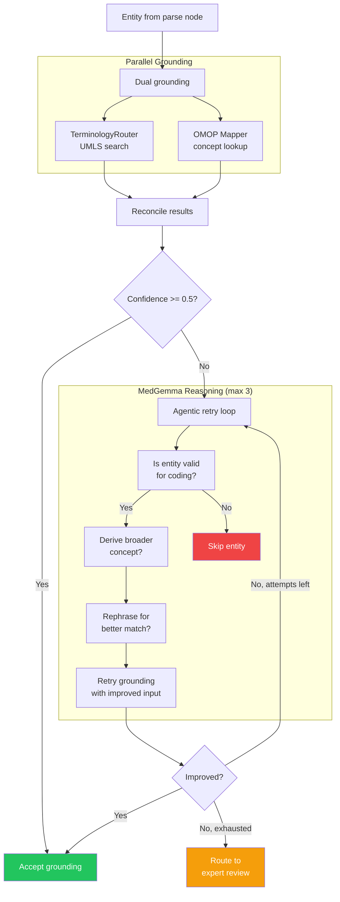

# Agentic Workflow

This document explains how ElixirTrials implements an agentic AI workflow, mapping the system's architecture to the criteria for the **Agentic Workflow Prize** in the MedGemma Impact Challenge.

## What Makes This an Agentic Workflow

An agentic workflow involves AI systems that autonomously plan, reason, use tools, and adapt their behavior based on intermediate results. ElixirTrials embodies all of these properties through its LangGraph pipeline with MedGemma as the reasoning agent.

## Agentic Properties

### 1. Autonomous Multi-Step Processing

The pipeline is a **7-node LangGraph StateGraph** where each node performs a distinct task, and the graph orchestrates execution with conditional routing:

```
ingest → extract → parse → ground → persist → structure → ordinal_resolve
```

- Each node operates autonomously on the pipeline state
- Conditional edges route to `END` on fatal errors (after ingest, extract, parse)
- PostgreSQL checkpointing enables resume-from-failure at any node
- Error accumulation allows partial failures without halting the pipeline

**Code**: `services/protocol-processor-service/src/protocol_processor/graph.py`

### 2. AI Decision-Making with MedGemma

MedGemma acts as the **autonomous decision-making agent** in the grounding pipeline:

1. **Candidate evaluation**: TerminologyRouter returns candidates from multiple APIs (UMLS, SNOMED, LOINC, RxNorm, ICD-10, HPO). MedGemma evaluates these candidates in context and selects the best match with a confidence score.

2. **Structured decision output**: MedGemma's free-form medical reasoning is structured by Gemini into a `GroundingDecision` with selected code, system, preferred term, confidence (0.0-1.0), and reasoning.

**Code**: `services/protocol-processor-service/src/protocol_processor/tools/medgemma_decider.py` &mdash; `medgemma_decide()`

### 3. Tool Use

The pipeline uses multiple external tools orchestrated by the agent:

| Tool | Purpose | Integration |
|------|---------|-------------|
| **TerminologyRouter** | Routes entities to vocabulary APIs by type | `tools/terminology_router.py` |
| **OMOP CDM Mapper** | Maps entities to OMOP concept IDs | `tools/omop_mapper.py` |
| **ToolUniverse SDK** | Unified access to 6 terminology systems | Via TerminologyRouter |
| **UMLS API** | Medical terminology search | Via TerminologyRouter |
| **Gemini File API** | PDF upload and extraction | `tools/gemini_extractor.py` |
| **Field Mapper** | AutoCriteria decomposition | `tools/field_mapper.py` |

Dual grounding runs TerminologyRouter and OMOP mapper **in parallel** per entity, then reconciles results with fuzzy agreement checking.

**Code**: `services/protocol-processor-service/src/protocol_processor/nodes/ground.py` &mdash; `_ground_entity_parallel()`

### 4. Feedback Loops (Agentic Retry)

When initial grounding confidence is below 0.5, MedGemma enters a **3-question reasoning loop** (max 3 attempts):

```
Initial grounding
       │
       ▼
  Confidence < 0.5?
       │
  Yes  │  No → Accept
       ▼
  MedGemma Reasoning:
    Q1: Is this a valid medical criterion?
        → No: Skip entity
        → Yes: Continue
    Q2: Is this a derived entity?
        → Yes: Use derived_term for retry
    Q3: Can this be rephrased?
        → Yes: Use rephrased_query for retry
       │
       ▼
  Retry grounding with improved query
       │
       ▼
  Improved? → Yes: Accept
             → No, attempts left: Loop back
             → No, exhausted: Route to expert review
```

This feedback loop is the core agentic behavior: the AI reasons about why grounding failed, reformulates its approach, and retries with new inputs.

**Code**: `services/protocol-processor-service/src/protocol_processor/tools/medgemma_decider.py` &mdash; `agentic_reasoning_loop()`

### 5. Human-in-the-Loop Safety Gate

The pipeline produces results for **clinician review**, not direct consumption:

- Split-pane UI shows original PDF alongside extracted criteria
- Clinicians approve, reject, or modify individual entities
- Modified entities can be re-grounded through the pipeline
- All decisions are tracked in the review audit trail

This human-in-the-loop design ensures clinical safety while maximizing AI automation.

**Code**: `apps/hitl-ui/` (React frontend), `services/api-service/src/api_service/reviews.py` (API)

### 6. Error Routing and Recovery

The pipeline implements graceful degradation:

- **Entity-level isolation**: Individual entity failures don't crash the batch (error accumulation pattern)
- **Expert review routing**: After 3 failed agentic attempts, entities are marked for expert review rather than silently dropped
- **Checkpoint resume**: PostgreSQL checkpointing via LangGraph enables resume from the last successful node
- **Circuit breaker**: External API calls use circuit breaker patterns to prevent cascade failures

**Code**: `services/protocol-processor-service/src/protocol_processor/nodes/ground.py`, `libs/shared/src/shared/resilience.py`

## Agentic Flow Diagram



## Full Pipeline as Agentic System

```
┌──────────────────────────────────────────────────────────┐
│                    ElixirTrials Pipeline                  │
│                                                          │
│  ┌────────┐   ┌─────────┐   ┌───────┐   ┌──────────┐  │
│  │ ingest │──>│ extract │──>│ parse │──>│  ground  │  │
│  └────────┘   └─────────┘   └───────┘   │          │  │
│                                          │ MedGemma │  │
│                                          │  Agent   │  │
│                                          │          │  │
│                                          │ Tools:   │  │
│                                          │ - UMLS   │  │
│                                          │ - OMOP   │  │
│                                          │ - SNOMED │  │
│                                          │ - LOINC  │  │
│                                          │ - RxNorm │  │
│                                          └────┬─────┘  │
│                                               │         │
│  ┌──────────────────┐   ┌───────────┐   ┌────┴────┐   │
│  │ ordinal_resolve  │<──│ structure │<──│ persist │   │
│  └────────┬─────────┘   └───────────┘   └─────────┘   │
│           │                                             │
└───────────┼─────────────────────────────────────────────┘
            │
            ▼
   ┌─────────────────┐
   │  HITL Review UI  │
   │ (Clinician gate) │
   └────────┬────────┘
            │
            ▼
   ┌─────────────────┐
   │    Exports       │
   │ CIRCE | FHIR |   │
   │    OMOP SQL      │
   └─────────────────┘
```
