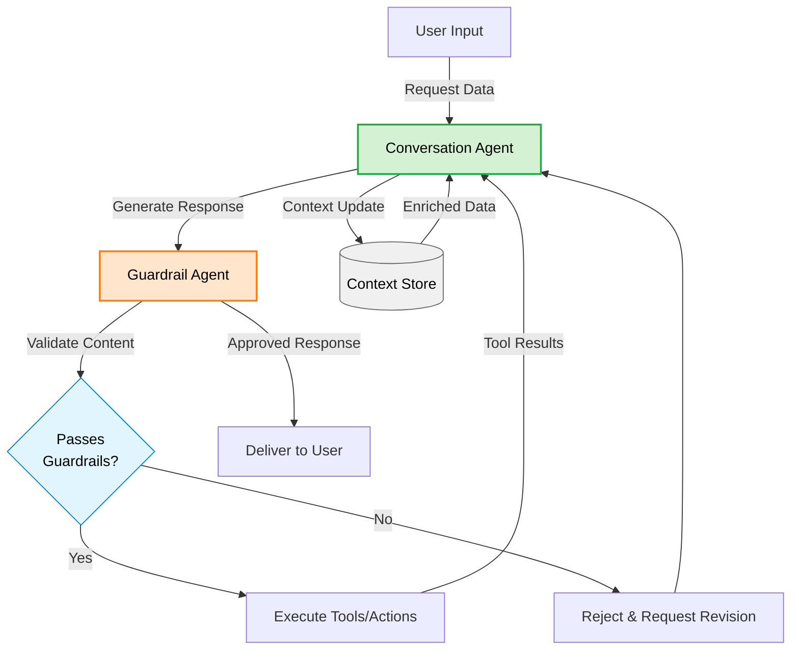

# ElixirTrials  - Project Overview

This document provides a comprehensive overview of the **ElixirTrials ** repository, its architecture, components, and development workflows.

---

## 🚀 Quick Start

### Prerequisites
- **Python 3.12+**
- **Node.js 20+**
- **uv** (Modern Python package manager)
- **Docker & Docker Compose**

### Installation
Clone the repository and sync dependencies:

```bash
# Sync Python dependencies using uv
uv sync

# Install frontend dependencies
cd apps/hitl-ui && npm install && cd ../..
```

---

## 🏗️ System Architecture

The project is a mono-repo combining Python backend services, LangGraph AI agents, and a React/Vite Human-in-the-Loop (HITL) frontend into a unified, high-performance architecture.

### LangGraph Architecture
The system follows a layered architecture:
- **Presentation Layer**: React frontend (HITL UI)
- **Application Layer**: FastAPI (API Service) + LangGraph Agents
- **Data Layer**: Context Store, Message History
- **Shared Layer**: Inference Service, Model Registry, Tool Registry

```mermaid
graph TB
    subgraph Presentation["🎨 Presentation Layer"]
        AdminUI[Admin Console UI]
        HostDash[Host Dashboard]
        GuestPanel[Guest Conversation Panel]
        OrchPanel[System Orchestration Panel]
    end

    subgraph Application["⚙️ Application Layer"]
        API[API Service]
        ConvAgent[Conversation Agent]
        GuardAgent[Guardrail Agent]
        EventStream[Event Stream Service]
    end

    subgraph Data["💾 Data Layer"]
        Context[(Context Store)]
        History[(Message History)]
        Signals[(Priority Signals)]
    end

    subgraph Shared["📦 Shared Components"]
        Inference[Inference Service]
        Models[Model Registry]
        Tools[Tool Registry]
    end

    AdminUI --> HostDash
    AdminUI --> GuestPanel
    AdminUI --> OrchPanel

    HostDash --> API
    GuestPanel --> API
    OrchPanel --> EventStream

    API --> ConvAgent
    API --> GuardAgent
    ConvAgent --> Inference
    GuardAgent --> Inference
    ConvAgent --> Tools

    EventStream --> ConvAgent
    EventStream --> GuardAgent

    ConvAgent --> Context
    ConvAgent --> History
    GuardAgent --> Signals

    Inference --> Models

    classDef presentation fill:#e1f5ff,stroke:#007acc,color:#000,stroke-width:2px;
    classDef application fill:#d4f1d4,stroke:#28a745,color:#000,stroke-width:2px;
    classDef data fill:#fff3cd,stroke:#ffc107,color:#000,stroke-width:2px;
    classDef shared fill:#f0f0f0,stroke:#666,color:#000,stroke-width:2px;

    class Presentation presentation;
    class Application application;
    class Data data;
    class Shared shared;
```



### Agent Workflows
The core logic resides in specialized LangGraph agents. Below is the typical flow for an agent interaction:



---

## 📦 Component Directory

### Orchestration & Frontend
| Component | Purpose | Path |
| :--- | :--- | :--- |
| **api-service** | Central FastAPI orchestrator. Manages DB persistence and triggers agents. | [api-service](services/api-service/) |
| **hitl-ui** | React/Vite dashboard for human-in-the-loop review and approval. | [hitl-ui](apps/hitl-ui/) |

### AI Agent Services
| Component | Purpose | Path |
| :--- | :--- | :--- |
| **extraction-service** | Criteria extraction from protocol PDFs using Gemini. | [extraction-service](services/extraction-service/) |
| **grounding-service** | Entity grounding to SNOMED using MedGemma and UMLS MCP. | [grounding-service](services/grounding-service/) |

### Data & Infrastructure
| Component | Purpose | Path |
| :--- | :--- | :--- |
| **inference** | Standard AI library for model loading, prompt management (Jinja2), and agent factories. | [inference](libs/inference/) |
| **data-pipeline** | ETL processes for data ingestion, normalization, and prep. | [data-pipeline](libs/data-pipeline/) |
| **evaluation** | Offline benchmarks and metrics for agent performance. | [evaluation](libs/evaluation/) |
| **model-training** | Fine-tuning (LoRA), distillation, and custom model training. | [model-training](libs/model-training/) |
| **shared** | Common Pydantic models and utility functions used by all components. | [shared](libs/shared/) |

---

## 🛠️ Key Workflows

### Creating a New Component
Use the provided script to scaffold a new microservice:
```bash
make create-service
```

### Database Management
We use **SQLModel** and **Alembic** for schema migrations.
- Create revision: `make db-revision msg="Add table"`
- Apply migration: `make db-migrate`

### Documentation Site
We use **MkDocs** with the Material theme and `mkdocstrings`.
- Build: `make docs-build`
- Serve: `make docs-serve` (Available at [http://localhost:8000](http://localhost:8000))

---

## 🧪 Testing & Quality

Detailed testing guidelines are available in `docs/testing-guide.md`.

- **Backend**: `pytest` with 85% coverage threshold (Ruff for linting).
- **Frontend**: `Vitest` for units, `Playwright` for E2E (ESLint for linting).
- **CI/CD**: Configured via GitHub Actions to run tests, linting, and docs building.

```bash
# Run all tests
make test-python
cd apps/hitl-ui && npm test && npm run test:e2e

# Run linting
make lint
```

---

## 📘 Resources & Further Reading
- [Testing Guide](file:///Users/noahdolevelixir/Code/TemplateRepo_ElixirTrials/docs/testing-guide.md)
- [Local Documentation Index](file:///Users/noahdolevelixir/Code/TemplateRepo_ElixirTrials/docs/index.md)
