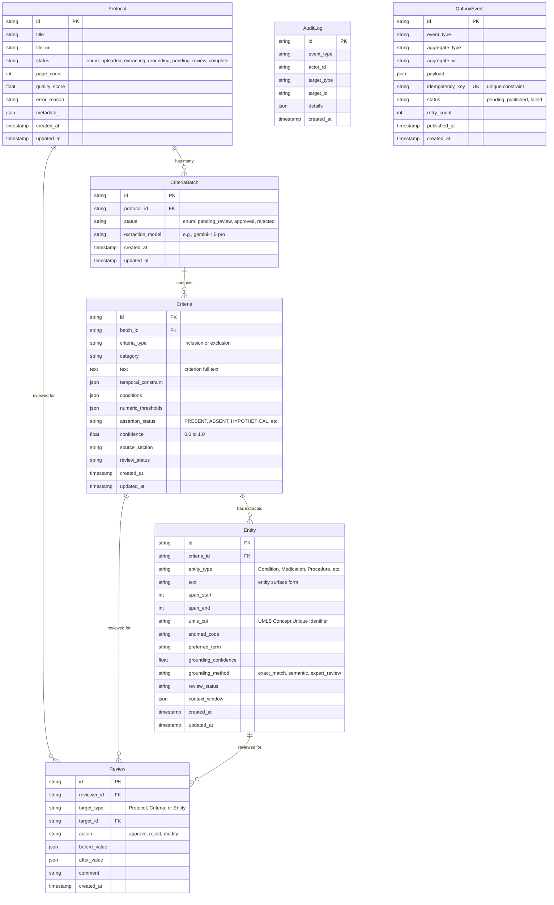
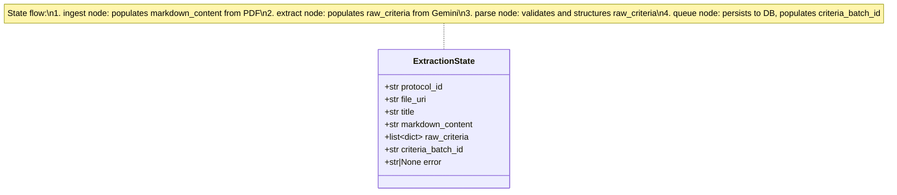
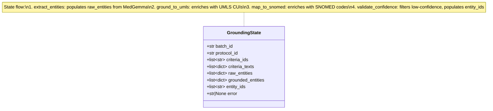

# Data Models

This page documents both the **database schema** (relational model for persistent storage) and the **LangGraph agent state structures** (TypedDict workflow state for agent execution).

## Database Schema

### Entity-Relationship Diagram



### Table Descriptions

**Protocol**: Represents an uploaded clinical trial protocol PDF. Tracks extraction pipeline status from upload through criteria extraction, entity grounding, and review completion.

**CriteriaBatch**: Groups criteria extracted from a single extraction run. Enables versioning (re-extraction with different models) and batch-level approval workflow.

**Criteria**: Individual inclusion/exclusion criterion extracted from a protocol. Contains structured fields (temporal constraints, numeric thresholds) parsed from natural language text.

**Entity**: Medical entity (condition, medication, procedure, etc.) extracted from criteria text and grounded to standardized vocabularies (UMLS CUI, SNOMED code).

**Review**: Records individual review actions (approve/reject/modify) by clinical researchers. Immutable audit trail with before/after values for data lineage.

**AuditLog**: Immutable event log for all system actions (extraction, grounding, review). Enables compliance reporting and debugging.

**OutboxEvent**: Transactional outbox for reliable async event delivery to agent services. Ensures atomic database + event writes without dual-write problem.

**Note:** All tables use UUID primary keys. Protocol, CriteriaBatch, Criteria, and Entity have created_at/updated_at timestamps. Review and AuditLog are immutable (created_at only).

## LangGraph State Schemas

### ExtractionState (Extraction Workflow)

The extraction-service uses `ExtractionState` TypedDict to carry data between graph nodes.



**Field descriptions:**

| Field | Type | Populated By | Purpose |
|-------|------|--------------|---------|
| `protocol_id` | `str` | Trigger handler | UUID of protocol being processed |
| `file_uri` | `str` | Trigger handler | GCS URI (gs://) or local path (local://) of PDF |
| `title` | `str` | Trigger handler | Protocol title from upload metadata |
| `markdown_content` | `str` | `ingest` node | Parsed PDF content via pymupdf4llm |
| `raw_criteria` | `list[dict]` | `extract` node | Criteria extracted by Gemini as dicts |
| `criteria_batch_id` | `str` | `queue` node | ID of persisted CriteriaBatch record |
| `error` | `str \| None` | Any node | Error message if node fails; enables conditional routing to END |

**Data flow:**

```
Trigger -> ingest (parses PDF) -> extract (calls Gemini) -> parse (validates) -> queue (persists) -> END
```

### GroundingState (Grounding Workflow)

The grounding-service uses `GroundingState` TypedDict to carry data between graph nodes.



**Field descriptions:**

| Field | Type | Populated By | Purpose |
|-------|------|--------------|---------|
| `batch_id` | `str` | Trigger handler | UUID of CriteriaBatch being processed |
| `protocol_id` | `str` | Trigger handler | UUID of parent protocol |
| `criteria_ids` | `list[str]` | Trigger handler | List of Criterion record IDs to process |
| `criteria_texts` | `list[dict]` | Trigger handler | Loaded criteria with id, text, type, category |
| `raw_entities` | `list[dict]` | `extract_entities` | Entities with span positions and types from MedGemma |
| `grounded_entities` | `list[dict]` | `ground_to_umls`, `map_to_snomed` | Entities enriched with UMLS CUI and SNOMED codes |
| `entity_ids` | `list[str]` | `validate_confidence` | Persisted Entity record IDs after DB storage |
| `error` | `str \| None` | Any node | Error message if node fails |

**Data flow:**

```
Trigger -> extract_entities -> ground_to_umls -> map_to_snomed -> validate_confidence -> END
```

### State Design Principles

- **TypedDict over Pydantic for graph state**: Lighter weight, LangGraph native integration
- **Every state has an `error: str | None` field**: Enables conditional routing to END on failure without raising exceptions
- **Fields are populated progressively**: Each node writes its output fields; downstream nodes read them
- **Trigger handlers initialize input fields**: IDs and URIs are set at workflow start; graph nodes populate derived fields
- **State is scoped to a single workflow run**: Not shared across runs; fresh state for each protocol or batch
