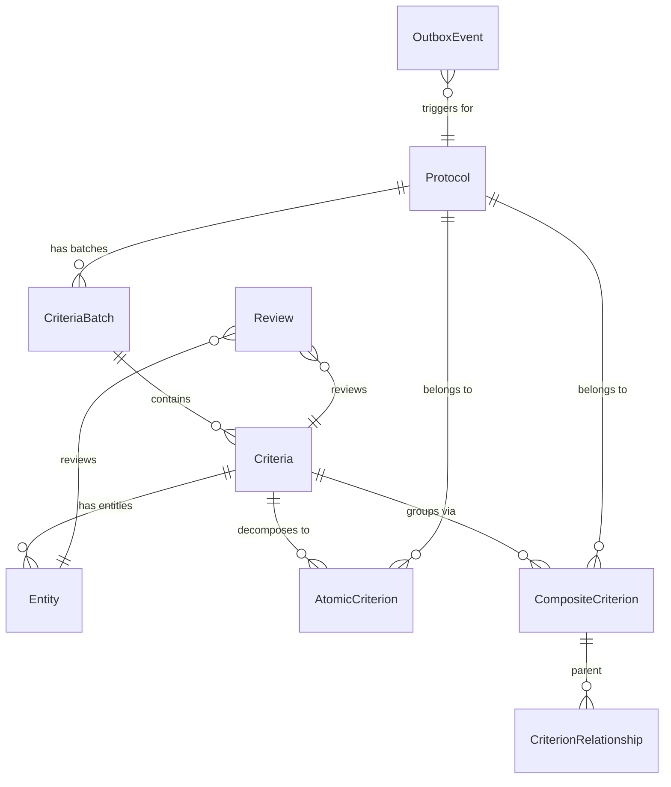
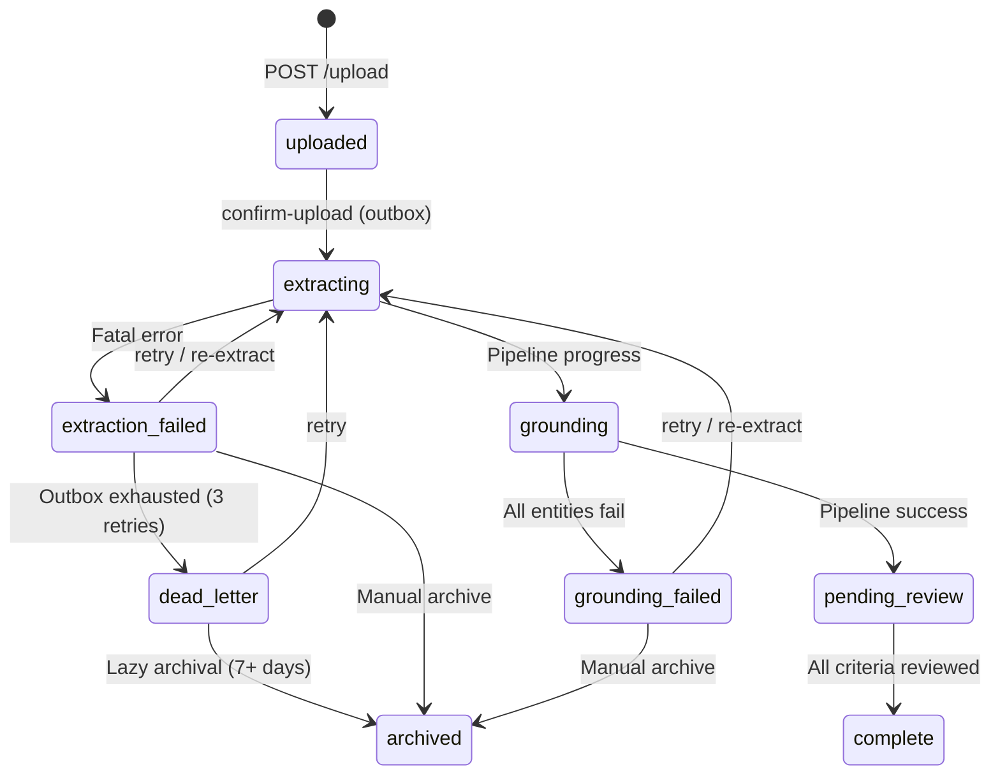

# Data Models

All domain models live in `libs/shared/src/shared/models.py` using SQLModel (SQLAlchemy + Pydantic).

## Entity-Relationship Overview

## Core Tables

### Protocol

Uploaded clinical trial protocol PDF. Central aggregate root.

| Column | Type | Description |
|--------|------|-------------|
| `id` | UUID (str) | Primary key |
| `title` | str | From filename or user input |
| `file_uri` | str | GCS URI (`gs://...`) or local path (`local://...`) |
| `status` | str | Current processing state (see lifecycle below) |
| `page_count` | int? | PDF page count from quality analysis |
| `quality_score` | float? | 0-1 score from PDF quality check |
| `error_reason` | str? | Human-readable failure message |
| `metadata_` | JSON | Quality details, pipeline_thread_id, error info |

**File**: `libs/shared/src/shared/models.py:59`

### Protocol Status Lifecycle

### CriteriaBatch

A batch of criteria extracted from a protocol. Re-extraction creates a new batch and archives old ones.

| Column | Type | Description |
|--------|------|-------------|
| `id` | UUID (str) | Primary key |
| `protocol_id` | FK → Protocol | Parent protocol |
| `status` | str | Batch review status |
| `extraction_model` | str? | Model used for extraction |
| `is_archived` | bool | Hidden from dashboard when True |

**File**: `libs/shared/src/shared/models.py:74`

### Criteria

Individual inclusion/exclusion criterion extracted from a protocol.

| Column | Type | Description |
|--------|------|-------------|
| `id` | UUID (str) | Primary key |
| `batch_id` | FK → CriteriaBatch | Parent batch |
| `criteria_type` | str | `inclusion` or `exclusion` |
| `text` | text | Original criterion text |
| `structured_criterion` | JSON? | Expression tree (Phase 2) |
| `conditions` | JSON? | Contains `field_mappings` from grounding |
| `confidence` | float | Extraction confidence (0-1) |
| `review_status` | str? | Human review decision |

**File**: `libs/shared/src/shared/models.py:86`

### Entity

Medical entity extracted from a criterion (e.g., "Type 2 diabetes", "HbA1c").

| Column | Type | Description |
|--------|------|-------------|
| `id` | UUID (str) | Primary key |
| `criteria_id` | FK → Criteria | Parent criterion |
| `entity_type` | str | `condition`, `measurement`, `drug`, etc. |
| `text` | str | Entity surface text |
| `snomed_code` | str? | SNOMED CT code |
| `rxnorm_code` | str? | RxNorm code |
| `loinc_code` | str? | LOINC code |
| `icd10_code` | str? | ICD-10 code |
| `omop_concept_id` | str? | OMOP CDM concept ID |

**File**: `libs/shared/src/shared/models.py:114`

### AtomicCriterion

Leaf node in an expression tree. Represents a single testable condition (e.g., "HbA1c >= 7%").

| Column | Type | Description |
|--------|------|-------------|
| `id` | UUID (str) | Primary key |
| `criterion_id` | FK → Criteria | Parent criterion |
| `protocol_id` | FK → Protocol | Owning protocol |
| `inclusion_exclusion` | str | `inclusion` or `exclusion` |
| `entity_domain` | str? | `condition`, `measurement`, `drug`, `demographics`, etc. |
| `omop_concept_id` | str? | OMOP concept ID for CDM joins |
| `entity_concept_id` | str? | Source terminology code |
| `entity_concept_system` | str? | `snomed`, `loinc`, `rxnorm` |
| `relation_operator` | str? | `>=`, `<=`, `=`, `>`, `<`, `!=` |
| `value_numeric` | float? | Numeric threshold |
| `value_text` | str? | Text value (e.g., "Class III-IV") |
| `unit_text` | str? | Unit label |
| `unit_concept_id` | int? | OMOP unit concept ID |
| `negation` | bool | True for negated conditions |

**File**: `libs/shared/src/shared/models.py:184`  
**Table**: `atomic_criteria`

### CompositeCriterion

Branch node in an expression tree. Combines children with AND/OR/NOT logic.

| Column | Type | Description |
|--------|------|-------------|
| `id` | UUID (str) | Primary key |
| `criterion_id` | FK → Criteria | Parent criterion |
| `protocol_id` | FK → Protocol | Owning protocol |
| `logic_operator` | str | `AND`, `OR`, `NOT` |

**File**: `libs/shared/src/shared/models.py:235`  
**Table**: `composite_criteria`

### CriterionRelationship

Edge in the expression tree. Links parent composite to child (atomic or composite).

| Column | Type | Description |
|--------|------|-------------|
| `parent_criterion_id` | FK → CompositeCriterion | Parent (PK) |
| `child_criterion_id` | str | Child ID (PK) |
| `child_type` | str | `atomic` or `composite` |
| `child_sequence` | int | Operand ordering |

**File**: `libs/shared/src/shared/models.py:263`  
**Table**: `criterion_relationships`

### Supporting Tables

| Table | Purpose | File line |
|-------|---------|-----------|
| `review` | Human review actions with before/after JSON | `models.py:144` |
| `auditlog` | Immutable log of all system events | `models.py:158` |
| `user` | Authenticated user accounts (Google OAuth) | `models.py:170` |
| `outboxevent` | Transactional outbox for event publishing | `models.py:285` |

## Pipeline State

The LangGraph pipeline passes state between nodes as a `PipelineState` TypedDict.

**File**: `services/protocol-processor-service/src/protocol_processor/state.py`

| Field | Type | Set by |
|-------|------|--------|
| `protocol_id` | str | Input (always present) |
| `file_uri` | str | Input |
| `title` | str | Input |
| `batch_id` | str? | parse node |
| `pdf_bytes` | bytes? | ingest node (cleared after extract) |
| `extraction_json` | str? | extract node |
| `entities_json` | str? | parse node |
| `grounded_entities_json` | str? | ground node |
| `archived_reviewed_criteria` | list? | Input (re-extraction only) |
| `ordinal_proposals_json` | str? | ordinal_resolve node |
| `status` | str | Each node |
| `error` | str? | Fatal errors → routes to END |
| `errors` | list[str] | Accumulated non-fatal errors |

State is serialized as JSON strings (not dicts) between nodes to minimize LangGraph checkpoint size.
