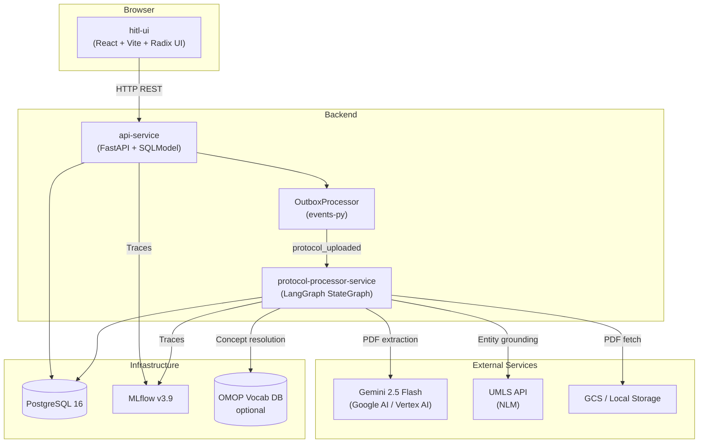
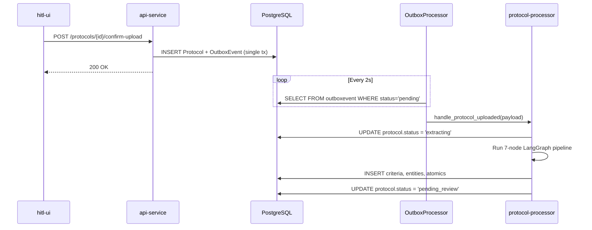

# System Architecture

## Container Diagram

## Communication Paths

### Synchronous HTTP (UI to API)

All UI interactions flow through the FastAPI REST API:

| Path | Description | Key file |
|------|-------------|----------|
| `POST /protocols/upload` | Generate signed upload URL | `services/api-service/src/api_service/protocols.py` |
| `POST /protocols/{id}/confirm-upload` | Confirm upload, trigger pipeline | `protocols.py` |
| `GET /protocols` | List protocols (paginated) | `protocols.py` |
| `GET /reviews/batches/{id}/criteria` | Fetch criteria for review | `reviews.py` |
| `POST /reviews/criteria/{id}/action` | Submit review decision | `reviews.py` |
| `GET /exports/{id}/circe` | Export as CIRCE JSON | `exports.py` |
| `GET /exports/{id}/fhir-group` | Export as FHIR R4 Group | `exports.py` |
| `GET /exports/{id}/evaluation-sql` | Export as OMOP SQL | `exports.py` |

### Asynchronous Event Processing (Outbox to Pipeline)

The pipeline is triggered via the transactional outbox pattern:

1. `confirm-upload` endpoint calls `persist_with_outbox()` — writes `Protocol` record + `OutboxEvent` in a single DB transaction
2. `OutboxProcessor` polls the `outboxevent` table every 2 seconds
3. When it finds a `protocol_uploaded` event, it calls `handle_protocol_uploaded()` in a thread executor
4. The handler invokes the 7-node LangGraph pipeline via `asyncio.run()`

### Storage Paths

- **Local dev**: Files stored in `./uploads/` directory, served by `api-service` at `/local-files/{path}`
- **Production**: Files uploaded to GCS via signed URL, fetched by pipeline from `gs://` URI

### Observability

- **MLflow**: Traces emitted by both `api-service` (request middleware) and pipeline nodes (per-node spans)
- **Tracking URI**: `http://localhost:5001` (local), `http://mlflow:5000` (Docker)
- **Experiment**: `protocol-processing`
- **Orphan cleanup**: `trigger.py` closes stale IN_PROGRESS traces at startup

## Authentication

- **Google OAuth 2.0** via `api-service/auth.py`
- Session middleware with JWT tokens
- All API routes (except `/auth/*` and `/health`) require authentication
- Dev mode works without OAuth configured

## Error Handling

| Error type | Behavior | Status |
|------------|----------|--------|
| Fatal (PDF corrupt, auth fail) | Pipeline stops at failed node | `extraction_failed` |
| Partial (some entities fail grounding) | Pipeline continues, errors accumulated | `pending_review` with `errors[]` |
| Total grounding failure | All entities failed | `grounding_failed` |
| Outbox exhaustion (3 retries) | Event marked dead_letter | `dead_letter` |
| Dead letter aging (7+ days) | Lazy archival on next access | `archived` |
