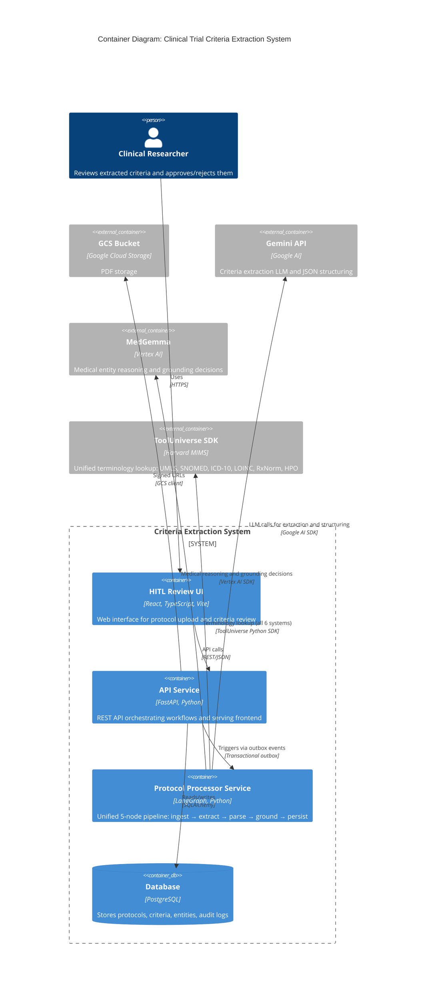

# System Architecture

This document provides the C4 Container (Level 2) view of the Clinical Trial Criteria Extraction System. It shows the system's high-level structure, technology stack choices, and how services communicate with each other and external systems.

## Container Diagram

The following diagram shows the major deployable containers in the system, their technologies, and their relationships.

## Service Communication Patterns

The system uses three distinct communication patterns for different interaction types.

### Frontend <-> Backend: REST over HTTPS

The HITL Review UI communicates with the API Service via synchronous REST calls using JSON payloads.

**Key characteristics:**

- Synchronous request/response via JSON payloads
- All endpoints documented in OpenAPI spec (accessible via `/docs`)
- Authentication via Google OAuth session cookies + JWT
- Pagination for large result sets (protocol lists, criteria batches)
- Error responses follow standard HTTP status codes

This pattern is appropriate for user-facing operations where immediate feedback is expected.

### Backend <-> Agents: Transactional Outbox Pattern

The API Service triggers the Protocol Processor Service asynchronously via the **transactional outbox pattern** to ensure reliable event delivery without the dual-write problem.

**Pattern flow:**

1. API Service commits database transaction (e.g., create Protocol record)
2. Within the same transaction, insert OutboxEvent record with event type (e.g., `ProtocolUploaded`)
3. OutboxProcessor polls pending events (every 5s)
4. Processor invokes agent trigger handler (e.g., `handle_protocol_uploaded` in protocol-processor-service)
5. On success, mark OutboxEvent as `published`; on failure, increment `retry_count` with exponential backoff

**Benefits:**

- **No dual-write problem:** Database write and event publish are atomic within a single transaction
- **Guaranteed delivery:** Events are persisted durably and retried until successful
- **Idempotency:** Each event has an `idempotency_key` to prevent duplicate processing

**Event types:**

| Event Type | Trigger | Target Service | Outcome |
|------------|---------|----------------|---------|
| `ProtocolUploaded` | Protocol created | protocol-processor-service | Runs full 5-node pipeline: extract criteria, parse, ground entities, persist |
| `ReviewCompleted` | Review approved | Future analytics | Triggers downstream analytics (future phase) |

**Note:** This shows the happy path. See Production Hardening documentation for error handling, dead letter queues, and circuit breaker patterns.

### Agents <-> External Services: SDK Calls

Agents communicate with external services via their respective SDKs:

- **Gemini API:** `google-genai` SDK for LLM-based criteria extraction from protocol PDFs and JSON structuring of MedGemma output
- **MedGemma (Vertex AI):** `vertexai` SDK for medical entity reasoning and grounding decision selection
- **ToolUniverse SDK:** `tooluniverse` Python package for unified terminology lookup across UMLS, SNOMED, ICD-10, LOINC, RxNorm, and HPO (Harvard MIMS lab; replaces all previous direct NLM API calls)

**Reliability characteristics:**

- All external calls include 30-second timeout configuration
- Exponential backoff retry logic (via `tenacity` library, max 3 retries)
- In-memory TTL cache (`cachetools.TTLCache`) for ToolUniverse results to reduce autocomplete latency
- MedGemma agentic reasoning loop (3 questions) before each retry on failed grounding attempts
- Max 3 grounding attempts per entity; after 3 failures, entity routes to `expert_review` queue

**Note:** This shows happy path behavior. See Production Hardening for timeout handling, fallback strategies, and degraded mode operations.
