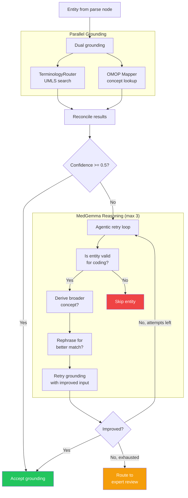

# Agent Flow

Agentic grounding pattern used when initial entity grounding has low confidence.

## Grounding Pipeline Details

### TerminologyRouter

Routes entities to the best UMLS source vocabulary based on entity type:

| Entity type | Primary vocabulary | Fallback |
|-------------|-------------------|----------|
| condition | SNOMED CT | ICD-10 |
| measurement | LOINC | SNOMED CT |
| drug | RxNorm | SNOMED CT |
| procedure | SNOMED CT | CPT |

### OMOP Mapper

Resolves entities to OMOP CDM concept IDs using the OMOP vocabulary tables. Enables direct joins against CDM data warehouses.

### Reconciliation

`_reconcile_dual_grounding()` merges results from both paths:

- Prefers OMOP concept ID when available (needed for exports)
- Falls back to source terminology codes
- Combines confidence scores from both paths

**File**: `services/protocol-processor-service/src/protocol_processor/nodes/ground.py`
