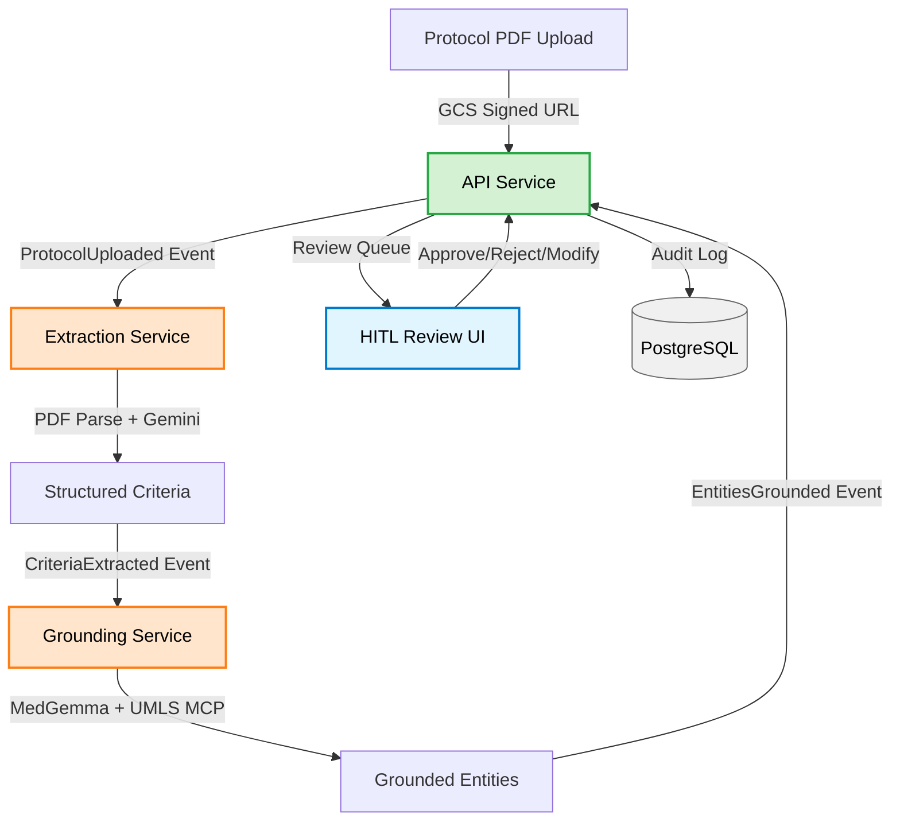

# Agent Flow

```mermaid
graph TD
    Upload[Protocol PDF Upload] -->|GCS Signed URL| API[API Service]
    API -->|ProtocolUploaded Event| Extract[Extraction Service]
    Extract -->|PDF Parse + Gemini| Criteria[Structured Criteria]
    Criteria -->|CriteriaExtracted Event| Ground[Grounding Service]
    Ground -->|MedGemma + UMLS MCP| Entities[Grounded Entities]
    Entities -->|EntitiesGrounded Event| API
    API -->|Review Queue| HITL[HITL Review UI]
    HITL -->|Approve/Reject/Modify| API
    API -->|Audit Log| DB[(PostgreSQL)]

    classDef service fill:#d4f1d4,stroke:#28a745,color:#000,stroke-width:2px;
    classDef agent fill:#ffe5cc,stroke:#fd7e14,color:#000,stroke-width:2px;
    classDef data fill:#f0f0f0,stroke:#666,color:#000;
    classDef ui fill:#e1f5ff,stroke:#007acc,color:#000,stroke-width:2px;

    class API service;
    class Extract,Ground agent;
    class DB data;
    class HITL ui;
```
