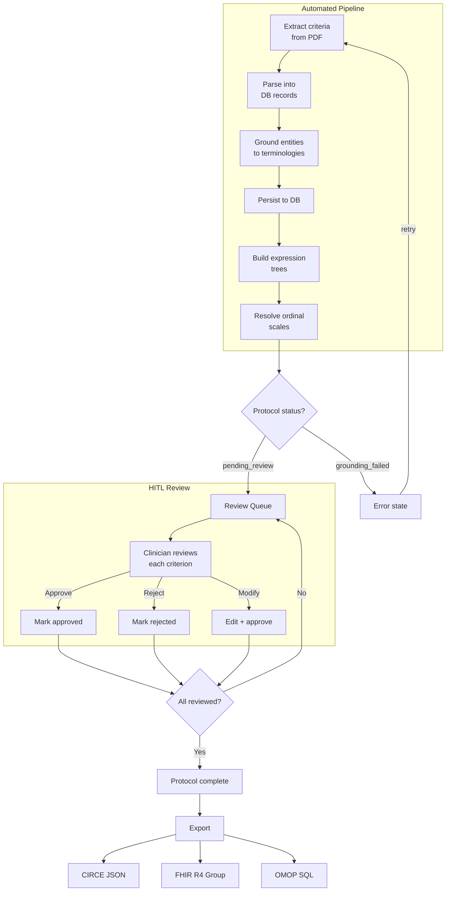

# HITL Flow

Human-in-the-loop review workflow from criteria extraction to final approval.

## Review States

| State | Meaning |
|-------|---------|
| `null` (pending) | Not yet reviewed |
| `approved` | Clinician confirmed AI output |
| `rejected` | Clinician marked as incorrect |
| `modified` | Clinician provided corrections |

## Audit Trail

Every review action creates a `Review` record with:

- `before_value` — state before the action
- `after_value` — state after the action
- `reviewer_id` — who performed the action
- `comment` — optional notes

System-level events (grounding, status transitions) are logged to `AuditLog`.
