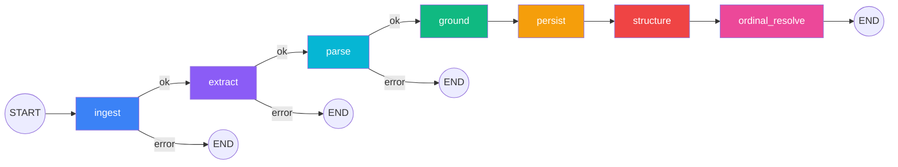

# LangGraph Pipeline Architecture

The protocol processing pipeline is implemented as a 7-node LangGraph StateGraph.

## Pipeline Graph



## Node Responsibilities

| Node | Purpose | Key tool | Error strategy |
|------|---------|----------|----------------|
| **ingest** | Fetch PDF bytes from storage | `fetch_pdf_bytes()` | Fatal → END |
| **extract** | LLM extraction of criteria from PDF | Gemini structured output | Fatal → END |
| **parse** | Create DB records, decompose entities | `decompose_entities_from_criterion()` | Fatal → END |
| **ground** | Link entities to SNOMED/LOINC/RxNorm/OMOP | TerminologyRouter + OMOP Mapper | Accumulate errors |
| **persist** | Write Entity records, update field_mappings | Direct DB writes | Accumulate errors |
| **structure** | Build expression trees from field_mappings | Gemini logic detection | Accumulate errors |
| **ordinal_resolve** | Identify ordinal scales, set unit_concept_id | Gemini ordinal detection | Accumulate errors |

## Error Routing

The first three nodes (ingest, extract, parse) use **conditional edges** — a fatal error routes to END immediately:

```python
workflow.add_conditional_edges(
    source,
    should_continue,    # checks state["error"]
    {"continue": target, "error": END},
)
```

The remaining nodes (ground, persist, structure, ordinal_resolve) use **error accumulation** — individual item failures are appended to `state["errors"]` but the pipeline continues.

## Checkpointing

The graph is compiled with an `AsyncPostgresSaver` checkpointer that persists state after each node:

- **Initial runs**: thread_id = `{protocol_id}:{uuid4}` (unique per run to prevent collision on re-extraction)
- **Retry**: `retry_from_checkpoint(protocol_id)` looks up `pipeline_thread_id` from protocol metadata and resumes with `ainvoke(None, config)` — LangGraph replays from the last successful node

**File**: `services/protocol-processor-service/src/protocol_processor/graph.py`

## State Shape

See [Data Models — Pipeline State](../architecture/data-models.md#pipeline-state) for the full `PipelineState` TypedDict.

Key design decisions:

- **JSON strings** over dicts for extraction/entity data — reduces checkpoint serialization size
- **pdf_bytes cleared** after extract — prevents storing megabytes in every checkpoint
- **errors as list[str]** — simple accumulation, no structured error objects
