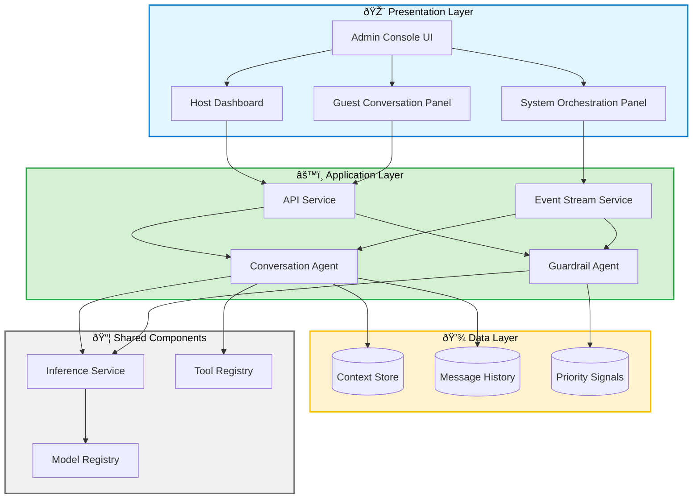

# LangGraph Architecture

```mermaid
graph TB
    subgraph Presentation["🎨 Presentation Layer"]
        AdminUI[Admin Console UI]
        HostDash[Host Dashboard]
        GuestPanel[Guest Conversation Panel]
        OrchPanel[System Orchestration Panel]
    end

    subgraph Application["âš™ï¸ Application Layer"]
        API[API Service]
        ConvAgent[Conversation Agent]
        GuardAgent[Guardrail Agent]
        EventStream[Event Stream Service]
    end

    subgraph Data["💾 Data Layer"]
        Context[(Context Store)]
        History[(Message History)]
        Signals[(Priority Signals)]
    end

    subgraph Shared["📦 Shared Components"]
        Inference[Inference Service]
        Models[Model Registry]
        Tools[Tool Registry]
    end

    AdminUI --> HostDash
    AdminUI --> GuestPanel
    AdminUI --> OrchPanel

    HostDash --> API
    GuestPanel --> API
    OrchPanel --> EventStream

    API --> ConvAgent
    API --> GuardAgent
    ConvAgent --> Inference
    GuardAgent --> Inference
    ConvAgent --> Tools

    EventStream --> ConvAgent
    EventStream --> GuardAgent

    ConvAgent --> Context
    ConvAgent --> History
    GuardAgent --> Signals

    Inference --> Models

    classDef presentation fill:#e1f5ff,stroke:#007acc,color:#000,stroke-width:2px;
    classDef application fill:#d4f1d4,stroke:#28a745,color:#000,stroke-width:2px;
    classDef data fill:#fff3cd,stroke:#ffc107,color:#000,stroke-width:2px;
    classDef shared fill:#f0f0f0,stroke:#666,color:#000,stroke-width:2px;

    class Presentation presentation;
    class Application application;
    class Data data;
    class Shared shared;
```
