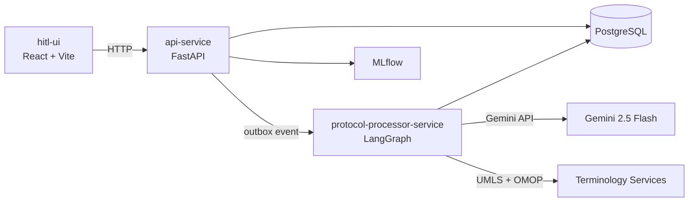

# ElixirTrials

AI-powered extraction and structuring of clinical trial eligibility criteria from protocol PDFs.

## What is ElixirTrials?

ElixirTrials takes a clinical trial protocol PDF and produces structured, coded eligibility criteria ready for cohort identification. The system combines:

- **Gemini-powered extraction** — LLM reads the PDF and extracts inclusion/exclusion criteria
- **Multi-terminology grounding** — entities are linked to SNOMED, LOINC, RxNorm, ICD-10 via UMLS + OMOP
- **Expression tree structuring** — criteria are decomposed into atomic conditions with AND/OR/NOT logic
- **Human-in-the-loop review** — clinicians review, approve, or modify AI-generated criteria
- **Standard exports** — output in OHDSI CIRCE, FHIR R4 Group, and OMOP CDM evaluation SQL

## Quick Start

```bash
# 1. Clone and configure
cp .env.example .env    # Fill in GOOGLE_API_KEY, UMLS_API_KEY, etc.

# 2. Start everything
make run-dev            # Starts DB + MLflow + API + UI

# 3. Open the UI
open http://localhost:3000
```

## Architecture at a Glance



## Documentation Map

| Section | What you'll find |
|---------|-----------------|
| [Onboarding](onboarding.md) | First-time setup, prerequisites, environment configuration |
| [Architecture](architecture/index.md) | System design, data models, service boundaries |
| [User Journeys](journeys/index.md) | End-to-end workflows with sequence diagrams |
| [Components](components/index.md) | Per-service deep dives with file paths |
| [Diagrams](diagrams/hitl-flow.md) | Visual reference for HITL, agent, and pipeline flows |
| [Code Tour](code-tour/index.md) | Slide-style walkthrough of key code paths |
| [Status](status/index.md) | What's production-ready vs experimental |
| [Guides](testing-guide.md) | Testing, auth setup, development guides |
