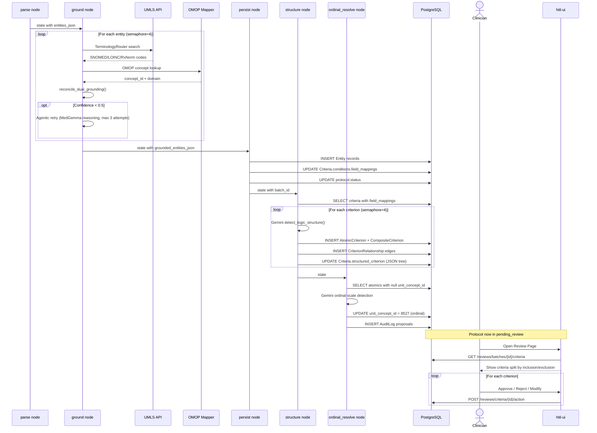

# Grounding, Structuring & HITL Review

How extracted entities get linked to standard terminologies, structured into expression trees, and reviewed by clinicians.

## Sequence Diagram



## Grounding Phase (ground node)

The ground node processes each entity through a dual-grounding pipeline:

### Dual Grounding

1. **TerminologyRouter** — routes entities to the appropriate UMLS source vocabulary (SNOMED for conditions, LOINC for labs, RxNorm for drugs)
2. **OMOP Mapper** — resolves entities to OMOP CDM concept IDs for data warehouse joins

Both run in parallel per entity (asyncio.gather), results reconciled in `_reconcile_dual_grounding()`.

### Agentic Retry Loop

When initial grounding confidence is below 0.5, the ground node enters an agentic reasoning loop (max 3 attempts):

1. Asks MedGemma: "Is this entity valid for coding?"
2. Asks: "Can we derive a parent/broader concept?"
3. Asks: "Can you rephrase for better matching?"
4. Retries grounding with improved input

If all attempts fail, the entity is marked for expert review.

**File**: `services/protocol-processor-service/src/protocol_processor/nodes/ground.py`

### Error Accumulation

Individual entity failures are collected in `state["errors"]` but don't stop the pipeline. The persist node decides the final status:

- All entities succeed → `pending_review`
- Some entities fail → `pending_review` (with errors logged)
- All entities fail → `grounding_failed`

## Persist Phase (persist node)

Creates `Entity` records in the database and updates `Criteria.conditions.field_mappings` with grounding results. Also handles review inheritance during re-extraction.

**File**: `services/protocol-processor-service/src/protocol_processor/nodes/persist.py`

## Structure Phase (structure node)

Builds expression trees for criteria that have `field_mappings` in their conditions JSON:

1. Queries criteria from the current batch
2. For each qualifying criterion, calls Gemini to detect logic structure (AND/OR/NOT)
3. Creates `AtomicCriterion` leaf records with OMOP concept IDs, operators, values
4. Creates `CompositeCriterion` branch records with logic operators
5. Creates `CriterionRelationship` edges linking parents to children
6. Stores the expression tree as `structured_criterion` JSON on the Criteria record

**File**: `services/protocol-processor-service/src/protocol_processor/nodes/structure.py`

### Expression Tree Example

For the criterion "HbA1c between 7.0% and 10.0%":

```json
{
  "type": "AND",
  "children": [
    {
      "type": "ATOMIC",
      "atomic_criterion_id": "uuid-1",
      "details": "HbA1c >= 7.0%"
    },
    {
      "type": "ATOMIC",
      "atomic_criterion_id": "uuid-2",
      "details": "HbA1c <= 10.0%"
    }
  ]
}
```

This maps to:

- 1 `CompositeCriterion` (operator=AND)
- 2 `AtomicCriterion` records (one for each bound)
- 2 `CriterionRelationship` edges

## Ordinal Resolution Phase (ordinal_resolve node)

Identifies atomic criteria that represent ordinal scales (e.g., NYHA class, ECOG score) and sets their `unit_concept_id` to 8527 (OMOP concept for ordinal).

**File**: `services/protocol-processor-service/src/protocol_processor/nodes/ordinal_resolve.py`

## HITL Review (ReviewPage.tsx)

The clinician reviews extracted criteria in a split-pane view:

- **Left panel**: PDF viewer (highlights source text for selected criterion)
- **Right panel**: Criteria list grouped by inclusion/exclusion, with filters for status, type, and confidence

For each criterion, the clinician can:

- **Approve** — confirms the AI extraction is correct
- **Reject** — marks as incorrect
- **Modify** — provides corrections

Review decisions are stored as `Review` records with before/after JSON for audit trail.

**File**: `apps/hitl-ui/src/screens/ReviewPage.tsx`

## Exports

Once criteria are reviewed, they can be exported in three formats:

| Format | Endpoint | Use case |
|--------|----------|----------|
| CIRCE JSON | `GET /exports/{id}/circe` | OHDSI cohort definition tools (ATLAS) |
| FHIR R4 Group | `GET /exports/{id}/fhir-group` | FHIR-based EHR systems |
| OMOP SQL | `GET /exports/{id}/evaluation-sql` | Direct CDM database queries |

All export builders consume the same `ProtocolExportData` dataclass, which loads the expression tree (atomics, composites, relationships) from the database.

**Files**:

- `services/api-service/src/api_service/exports.py`
- `services/api-service/src/api_service/exporters/circe_builder.py`
- `services/api-service/src/api_service/exporters/fhir_group_builder.py`
- `services/api-service/src/api_service/exporters/evaluation_sql_builder.py`
