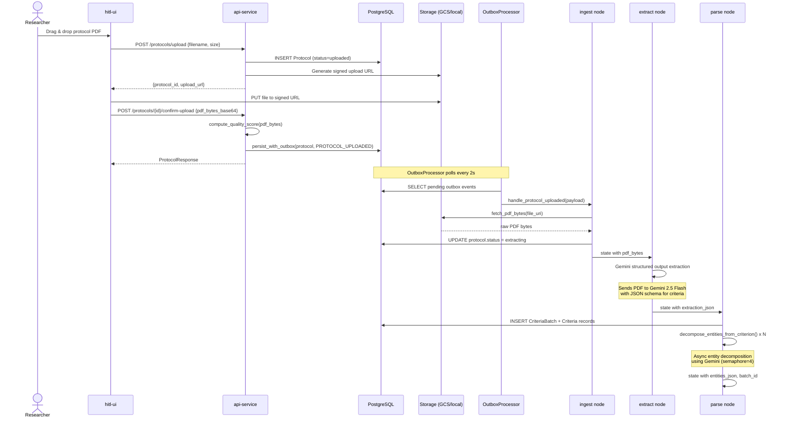

# Upload & Extraction Journey

How a protocol PDF goes from the researcher's browser to structured criteria in the database.

## Sequence Diagram

## Step-by-Step

### 1. Upload Dialog (`ProtocolUploadDialog.tsx`)

The user opens the upload dialog in the HITL UI. Client-side validation enforces:

- PDF content type only
- 50 MB maximum file size

**File**: `apps/hitl-ui/src/components/ProtocolUploadDialog.tsx`

### 2. Signed URL Generation (`protocols.py`)

The API creates a `Protocol` record (status: `uploaded`) and returns a signed URL for direct browser-to-GCS upload. If the Gemini circuit breaker is open, the protocol is marked `pending` with a warning.

**File**: `services/api-service/src/api_service/protocols.py:136`

### 3. Upload Confirmation (`protocols.py`)

After the browser uploads the file, it calls `confirm-upload`. This endpoint:

1. Optionally decodes `pdf_bytes_base64` and computes a quality score (page count, text extractability)
2. Stores quality metadata on the GCS blob
3. Writes the `PROTOCOL_UPLOADED` outbox event in the same transaction as the protocol update

**File**: `services/api-service/src/api_service/protocols.py:205`

### 4. Outbox Processing (`events-py/outbox.py`)

The `OutboxProcessor` runs as a background task inside `api-service`. It polls for pending events and dispatches them to registered handlers in a thread executor (to avoid blocking FastAPI).

**File**: `libs/events-py/src/events_py/outbox.py`

### 5. Ingest Node (`nodes/ingest.py`)

First pipeline node. Fetches the raw PDF bytes from GCS (or local storage) and updates the protocol status to `extracting`.

**File**: `services/protocol-processor-service/src/protocol_processor/nodes/ingest.py`

### 6. Extract Node (`nodes/extract.py`)

Sends the PDF to Gemini 2.5 Flash with a structured output schema requesting:

- Criteria text (inclusion/exclusion)
- Category classification
- Confidence scores

Returns a JSON string of extracted criteria. The PDF bytes are cleared from state after this step to reduce checkpoint size.

**File**: `services/protocol-processor-service/src/protocol_processor/nodes/extract.py`

### 7. Parse Node (`nodes/parse.py`)

Converts extraction JSON into database records:

1. **Phase A**: Creates `CriteriaBatch` and `Criteria` records in the database
2. **Phase B**: Runs `decompose_entities_from_criterion()` concurrently (asyncio.gather with semaphore=4) to identify medical entities within each criterion

Produces `entities_json` in state for the grounding phase.

**File**: `services/protocol-processor-service/src/protocol_processor/nodes/parse.py`

## Error Handling

| Failure | Response |
|---------|----------|
| Invalid file type | 400 error at upload |
| File too large (>50MB) | 400 error at upload |
| PDF quality too low | Pipeline may fail at extract with `extraction_failed` |
| Gemini API down | Circuit breaker opens; protocol queued as `pending` |
| Extraction LLM error | `extraction_failed` status; retryable via `/retry` endpoint |

## Re-Extraction

The `POST /protocols/{id}/re-extract` endpoint allows re-running extraction without re-uploading:

1. Archives all existing non-archived batches (preserves review history)
2. Collects reviewed criteria from archived batches for fuzzy-match inheritance
3. Triggers the same pipeline via a new `PROTOCOL_UPLOADED` outbox event
4. New batch criteria inherit review decisions from archived criteria (>90% text match, same type)

**File**: `services/api-service/src/api_service/protocols.py:360`
